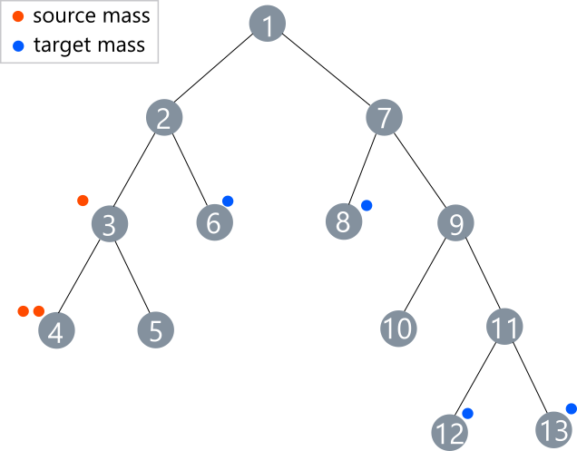
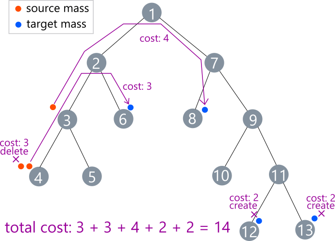

# Fast Unbalanced Optimal Transport on a Tree (NeurIPS 2020)

This is a C++ implementation and its Python wrapper of the fast computation of the generalized Kantorovich Rubinstein (GKR) distance on tree metrics.

## How to use C++ implementation

The C++ implementation requires no dependencies. `example.cpp` is an example code. This takes the following input of 3n lines from the standard input, where n is the number of nodes in the input tree. The first line specifies the number of nodes, the second to n-th lines specify the tree structure, the (n+1)-th to 2n-th lines specify the mass creation and destruction costs., and (2n+1)-th to 3n-th lines spcify the input measures. 

```
n
a_1 b_1 l_1
a_2 b_2 l_2
...
a_{n-1} b_{n-1} l_{n-1}
c_1 d_1
c_2 d_2
...
c_n d_n
x_1 y_1
x_2 y_2
...
x_n y_n
```

where `(a_i, b_i, l_i)` indicates that the i-th edge connects node `a_i` to `b_i` with length `l_i`, `(c_j, d_j)` indicates that the mass creation and destruction costs at node `j` is `c_j` and `d_j`, and `(x_j, y_j)` indicates that there are `x_j` source mass and `y_j` target mass at node `j`. The node indices are 1-indexed. An sample input file `sample_input.txt` is available.

You can complie the code by `g++ -o sample sample.cpp treegkr.cpp -std=gnu++11`.

The sample input represents the following instance. Each edge is of length one.



The optial transport of this instance is the following plan.



Thus, the optimal cost is 14. Let's check this using our code.

```
$ g++ -o sample sample.cpp treegkr.cpp -std=gnu++11
$ ./sample < ./sample_input.txt
14
```

## How to use Python wrapper

The python wrapper requires Boost.Python and cmake (>= 3.12). You can install them by

```
$ sudo apt install python3 build-essential python3-dev cmake libboost-all-dev
```

Be sure that libboost_python is compatible with your python version. You can build the wrapper by

```
$ mkdir build
$ cd build
$ cmake ..
$ cmake --build .
$ python3 -c "import treegkr; help(treegkr.treegkr)" 
```

For example, you can use `sample.py`.

```
$ PYTHONPATH=./build python3 sample.py < sample_input.txt
14.0
```

When you use the wrapper, be sure that `treegkr.so` is installed in the search path for modules.

## Feedback and Contact

Please feel free to contact me at r.sato AT ml.ist.i.kyoto-u.ac.jp, or to open issues.

## Citation

```
@inproceedings{sato2020fast,
  author    = {Ryoma Sato and Makoto Yamada and Hisashi Kashima},
  title     = {Fast Unbalanced Optimal Transport on a Tree},
  booktitle = {Advances in Neural Information Processing Systems 33: Annual Conferenceon Neural Information Processing Systems 2020, NeurIPS},
  year      = {2020},
}
```